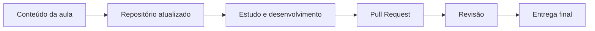

<div align="center">
  
</div>

<div align="center">
  
</div>

<h1 align="center">Bem-vindos à organização da 1TDSPO 👋</h1>

<p align="center">
  <strong>Nosso espaço oficial para códigos, projetos, exercícios, materiais de apoio e entregas da turma.</strong>
</p>

<p align="center">
  <a href="https://github.com/1TDSPO">
    
  </a>
  <a href="https://discord.gg/SEU-LINK">
    
  </a>
  <a href="https://www.fiap.com.br/">
    
  </a>
</p>

---

## Sobre este espaço

Esta organização foi criada para manter o conteúdo da **1TDSPO** centralizado, acessível e fácil de acompanhar. Aqui ficam os códigos desenvolvidos em aula, projetos da turma, materiais complementares, exercícios e documentos importantes ao longo do semestre.

> [!IMPORTANT]
> Antes de começar uma atividade, confira o README do repositório correspondente. Ele contém instruções, requisitos, prazos e orientações específicas.

## Acesso rápido

| Área | Conteúdo | Link |
|:---:|---|:---:|
| 📚 | Materiais e códigos das aulas | [Acessar](https://github.com/1TDSPO?tab=repositories) |
| 🚀 | Projetos e challenges | [Acessar](https://github.com/1TDSPO/projeto-principal) |
| 📅 | Calendário de entregas | [Acessar](https://docs.google.com/spreadsheets/d/SEU-LINK) |
| 📝 | Documentação da turma | [Acessar](https://www.notion.so/SEU-LINK) |
| 💬 | Canal de comunicação | [Acessar](https://discord.gg/SEU-LINK) |
| 🆘 | Dúvidas e suporte | [Abrir uma discussão](https://github.com/orgs/1TDSPO/discussions) |

## Tecnologias que fazem parte da jornada

<div align="center">
  
</div>

## Organização dos repositórios

Para facilitar buscas e manter um padrão, os repositórios devem seguir esta estrutura:

```text
disciplina-semestre-tipo-nome
```

Exemplos:

```text
front-2sem-aula-01
python-2sem-checkpoint-01
software-design-challenge-soulmove
database-2sem-exercicios
```

| Prefixo | Uso |
|---|---|
| `front` | Front-end, HTML, CSS, JavaScript, TypeScript e React |
| `python` | Lógica, automação, análise de dados e APIs |
| `database` | Modelagem, SQL e banco de dados |
| `software-design` | Arquitetura, UX/UI e projetos integrados |
| `challenge` | Entregas multidisciplinares do semestre |

## Como contribuir

1. Acesse o repositório da atividade.
2. Leia todas as instruções do README.
3. Crie uma branch com um nome claro: `nome-da-feature` ou `nome-integrante/atividade`.
4. Faça commits pequenos e descritivos.
5. Abra um Pull Request explicando o que foi desenvolvido.
6. Aguarde a revisão antes de realizar o merge.

```bash
git clone https://github.com/1TDSPO/NOME-DO-REPOSITORIO.git
git checkout -b seu-nome/atividade
git add .
git commit -m "feat: descreve brevemente a alteração"
git push origin seu-nome/atividade
```

> [!TIP]
> Evite mensagens como `alteração`, `coisas` ou `agora vai`. Um bom commit explica o que mudou sem exigir uma investigação criminal.

## Combinados da turma

- Não envie senhas, tokens, credenciais ou dados pessoais aos repositórios.
- Não altere o trabalho de outra pessoa sem conversar antes.
- Documente decisões importantes no README do projeto.
- Mantenha nomes de arquivos, branches e commits claros.
- Respeite os prazos e sinalize bloqueios com antecedência.
- Em trabalhos em grupo, todos devem participar e compreender a entrega.
- Código copiado sem entendimento não conta como aprendizado — nem como milagre.

## Integrantes

Substitua os perfis provisórios abaixo pelos integrantes reais da turma.

<div align="center">

| Integrante | GitHub | LinkedIn | Responsabilidade |
|---|:---:|:---:|---|
| Nome Sobrenome | [GitHub](https://github.com/usuario-01) | [LinkedIn](https://linkedin.com/in/usuario-01) | Tech Lead |
| Nome Sobrenome | [GitHub](https://github.com/usuario-02) | [LinkedIn](https://linkedin.com/in/usuario-02) | Tech Lead |
| Nome Sobrenome | [GitHub](https://github.com/usuario-03) | [LinkedIn](https://linkedin.com/in/usuario-03) | QA |
| Nome Sobrenome | [GitHub](https://github.com/usuario-04) | [LinkedIn](https://linkedin.com/in/usuario-04) | QA |
| Nome Sobrenome | [GitHub](https://github.com/usuario-05) | [LinkedIn](https://linkedin.com/in/usuario-05) | Desenvolvimento |
| Nome Sobrenome | [GitHub](https://github.com/usuario-06) | [LinkedIn](https://linkedin.com/in/usuario-06) | Desenvolvimento |

</div>

## Disciplinas e responsáveis

| Disciplina | Professor(a) | Materiais |
|---|---|:---:|
| Front-end Design | Nome do professor | [Acessar](https://github.com/1TDSPO/front-end) |
| Computational Thinking with Python | Nome do professor | [Acessar](https://github.com/1TDSPO/python) |
| Database Application & Data Science | Nome do professor | [Acessar](https://github.com/1TDSPO/database) |
| Software Design & Total Experience | Nome do professor | [Acessar](https://github.com/1TDSPO/software-design) |
| Domain Driven Design | Nome do professor | [Acessar](https://github.com/1TDSPO/ddd) |

## Fluxo das atividades



## Intervalo cultural obrigatório

<div align="center">
  
  <br />
  <sub><em>Quando o código roda de primeira e ninguém sabe explicar o motivo.</em></sub>
</div>

## Links úteis

- [Portal do Aluno FIAP](https://on.fiap.com.br/)
- [Documentação do GitHub](https://docs.github.com/pt)
- [Guia de Markdown](https://www.markdownguide.org/basic-syntax/)
- [Conventional Commits](https://www.conventionalcommits.org/pt-br/v1.0.0/)
- [MDN Web Docs](https://developer.mozilla.org/pt-BR/)
- [Documentação do React](https://react.dev/)
- [Documentação do TypeScript](https://www.typescriptlang.org/docs/)
- [Documentação do Python](https://docs.python.org/pt-br/3/)

## Precisa de ajuda?

Use a aba **Discussions** para dúvidas gerais e a aba **Issues** para erros, tarefas ou melhorias específicas. Ao pedir ajuda, informe:

- o que você estava tentando fazer;
- o resultado esperado;
- o que aconteceu de fato;
- mensagem de erro completa;
- print ou trecho de código relevante.

---

<div align="center">
  
  <h3>1TDSPO — código no GitHub e samba-rock no coração.</h3>
  <p>Feito pela turma, para a turma. 💻🫒</p>
</div>

<div align="center">
  
</div>
