<!-- Mantenha README.md e os arquivos visuais na mesma pasta. -->
<div align="center">
  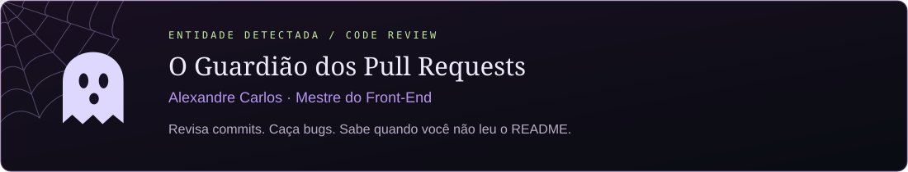
</div>


<p align="center"><a href="https://github.com/orgs/1TDSPO-26/repositories">🕸️ Repositórios</a> · <a href="https://discord.gg/awnetKUdN">👻 Discord</a> · <a href="https://on.fiap.com.br/">🌙 Portal FIAP</a></p>

> **Bem-vindo à 1TDSPO.** Entre, puxe uma cadeira e confira sua branch. O verdadeiro terror é descobrir que você trabalhou na errada.

> Push direto na `main` pode invocar esta entidade. Estude bastante: o próximo code review pode ser o seu.

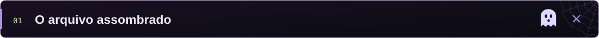

Esta organização foi criada para manter o conteúdo da **1TDSPO** centralizado, acessível e fácil de acompanhar. Aqui ficam os códigos desenvolvidos em aula, projetos da turma, materiais complementares, exercícios e documentos importantes ao longo do semestre.

> [!IMPORTANT]
> Antes de começar uma atividade, confira o README do repositório correspondente. Ele contém instruções, requisitos, prazos e orientações específicas.

<br />

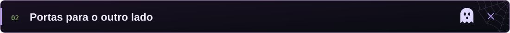

| Área | Conteúdo                                              |                               Link                               |
| :--: | ----------------------------------------------------- | :--------------------------------------------------------------: |
|  📚  | Arquivo de evidências — materiais e códigos das aulas |    [Acessar](https://github.com/orgs/1TDSPO-26/repositories)     |
|  🚀  | Experimentos — projetos CP Continuado                 | [Acessar](https://github.com/1TDSPO-26/portal-locais-acessiveis)                         |
|  💬  | Rádio dos sobreviventes — comunicação                 |             [Acessar](https://discord.gg/awnetKUdN)              |

<br />


As ferramentas da nossa jornada em **Front-End**. Equipe-se antes de entrar.

<div align="center">
  
</div>

<br />

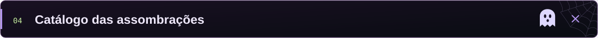

Até uma casa assombrada precisa de organização. Para facilitar buscas e manter um padrão, os repositórios devem seguir esta estrutura:

```text
disciplina-semestre-tipo-nome
```

Exemplos:

```text
front-2sem-aula-01
python-2sem-checkpoint-01
software-design-challenge-soulmove
database-2sem-exercicios
```

<br />

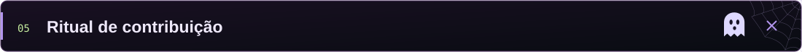

1. Acesse o repositório da atividade.
2. Leia todas as instruções do README.
3. Crie uma branch com um nome claro: `nome-da-feature` ou `nome-integrante/atividade`.
4. Faça commits pequenos e descritivos.
5. Abra um Pull Request explicando o que foi desenvolvido.
6. Aguarde a revisão antes de realizar o merge.

```bash
git clone https://github.com/1TDSPO-26/NOME-DO-REPOSITORIO.git
git checkout -b seu-nome/atividade
git add .
git commit -m "feat: descreve brevemente a alteração"
git push origin seu-nome/atividade
```

> [!TIP]
> Evite mensagens como `alteração`, `coisas` ou `agora vai`. Um bom commit explica o que mudou sem exigir uma investigação criminal.

<br />

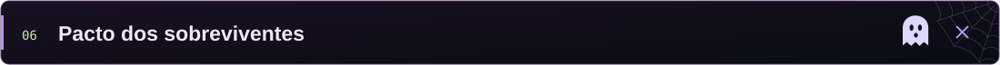

- Não envie senhas, tokens, credenciais ou dados pessoais aos repositórios.
- Não altere o trabalho de outra pessoa sem conversar antes.
- Documente decisões importantes no README do projeto.
- Mantenha nomes de arquivos, branches e commits claros.
- Respeite os prazos e sinalize bloqueios com antecedência.
- Em trabalhos em grupo, todos devem participar e compreender a entrega.
- Código copiado sem entendimento não conta como aprendizado — nem como milagre.

<br />

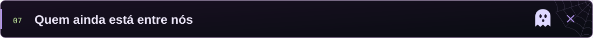

Conheça os desenvolvedores da **1TDSPO**. Clique na foto para acessar o perfil de cada integrante no GitHub.

<table align="center">
  <tr>
    <td align="center"><a href="https://github.com/BorbaGustavo"><br><sub><b>Gustavo Borba - Tech Lead</b></sub><br><sub>@BorbaGustavo</sub></a></td>
    <td align="center"><a href="https://github.com/Enzo-N-Freitas"><br><sub><b>Enzo Negrão - Tech Lead</b></sub><br><sub>@Enzo-N-Freitas</sub></a></td>
  </tr>
  <tr>
    <td align="center"><a href="https://github.com/AnaMendes-25"><br><sub><b>Ana Mendes - QA</b></sub><br><sub>@AnaMendes-25</sub></a></td>
    <td align="center"><a href="https://github.com/otomendes"><br><sub><b>Oto Mendes - QA</b></sub><br><sub>@otomendes</sub></a></td>
    <td align="center"><a href="https://github.com/arthurmartinss"><br><sub><b>Arthur Martins - QA</b></sub><br><sub>@arthurmartinss</sub></a></td>
    <td align="center"><a href="https://github.com/abrantes1"><br><sub><b>Lucas Abrantes - QA</b></sub><br><sub>@abrantes1</sub></a></td>
  </tr>
  <tr>
    <td align="center"><a href="https://github.com/U-Ale"><br><sub><b>Alexandre Prazeres</b></sub><br><sub>@U-Ale</sub></a></td>
    <td align="center"><a href="https://github.com/AlexandreTeixeiraS"><br><sub><b>Alexandre Teixeira</b></sub><br><sub>@AlexandreTeixeiraS</sub></a></td>
    <td align="center"><a href="https://github.com/allex1930"><br><sub><b>Allex Oliveira</b></sub><br><sub>@allex1930</sub></a></td>
    <td align="center"><a href="https://github.com/Canevari2"><br><sub><b>Canevari</b></sub><br><sub>@Canevari2</sub></a></td>
  </tr>
  <tr>
    <td align="center"><a href="https://github.com/cesarledres"><br><sub><b>César Ledres</b></sub><br><sub>@cesarledres</sub></a></td>
    <td align="center"><a href="https://github.com/di-zanon"><br><sub><b>Diego Zanon</b></sub><br><sub>@di-zanon</sub></a></td>
    <td align="center"><a href="https://github.com/enzoleiva2008-blip"><br><sub><b>Enzo Leiva</b></sub><br><sub>@enzoleiva2008-blip</sub></a></td>
    <td align="center"><a href="https://github.com/Felipeads12"><br><sub><b>Felipe Passos</b></sub><br><sub>@Felipeads12</sub></a></td>
  </tr>
  <tr>
    <td align="center"><a href="https://github.com/Gracetti"><br><sub><b>Igor Gracetti</b></sub><br><sub>@Gracetti</sub></a></td>
    <td align="center"><a href="https://github.com/juliaraalmeida77-ux"><br><sub><b>Júlia Rodrigues</b></sub><br><sub>@juliaraalmeida77-ux</sub></a></td>
    <td align="center"><a href="https://github.com/Kaua056"><br><sub><b>Kauã</b></sub><br><sub>@Kaua056</sub></a></td>
    <td align="center"><a href="https://github.com/KauanMattos"><br><sub><b>Kauan Mattos</b></sub><br><sub>@KauanMattos</sub></a></td>
  </tr>
  <tr>
    <td align="center"><a href="https://github.com/KauaznX"><br><sub><b>KauaznX</b></sub><br><sub>@KauaznX</sub></a></td>
    <td align="center"><a href="https://github.com/LucasAlmeidaOliveira"><br><sub><b>Lucas Almeida</b></sub><br><sub>@LucasAlmeidaOliveira</sub></a></td>
    <td align="center"><a href="https://github.com/mariabatistaescandor-gif"><br><sub><b>Maria Eduarda Escandor</b></sub><br><sub>@mariabatistaescandor-gif</sub></a></td>
    <td align="center"><a href="https://github.com/mariaeduardaalima"><br><sub><b>Maria Eduarda Lima</b></sub><br><sub>@mariaeduardaalima</sub></a></td>
  </tr>
  <tr>
    <td align="center"><a href="https://github.com/Mateus-Isaque"><br><sub><b>Mateus Isaque</b></sub><br><sub>@Mateus-Isaque</sub></a></td>
    <td align="center"><a href="https://github.com/matheusleite21"><br><sub><b>Matheus Leite</b></sub><br><sub>@matheusleite21</sub></a></td>
    <td align="center"><a href="https://github.com/Nezio22"><br><sub><b>Matheus Nézio</b></sub><br><sub>@Nezio22</sub></a></td>
    <td align="center"><a href="https://github.com/matheusruiz-07"><br><sub><b>Matheus Ruiz</b></sub><br><sub>@matheusruiz-07</sub></a></td>
  </tr>
  <tr>
    <td align="center"><a href="https://github.com/MatheuSegura"><br><sub><b>Matheus Segura</b></sub><br><sub>@MatheuSegura</sub></a></td>
    <td align="center"><a href="https://github.com/melissafiuza"><br><sub><b>Melissa Fiuza</b></sub><br><sub>@melissafiuza</sub></a></td>
    <td align="center"><a href="https://github.com/MuriloSCruzz"><br><sub><b>Murilo Cruz</b></sub><br><sub>@MuriloSCruzz</sub></a></td>
    <td align="center"><a href="https://github.com/ropark-tech"><br><sub><b>Roberto Park</b></sub><br><sub>@ropark-tech</sub></a></td>
  </tr>
  <tr>
    <td align="center"><a href="https://github.com/Rochagx"><br><sub><b>Rocha</b></sub><br><sub>@Rochagx</sub></a></td>
    <td align="center"><a href="https://github.com/theo4321"><br><sub><b>Theo</b></sub><br><sub>@theo4321</sub></a></td>
  </tr>
</table>

<br />

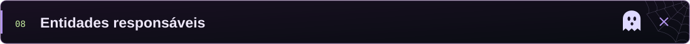

| Disciplina       | Professor        |                    GitHub                    |
| ---------------- | ---------------- | :------------------------------------------: |
| Front-end Design | Alexandre Carlos | [Acessar](https://github.com/alecarlosjesus) |

<br />

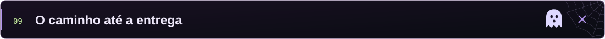

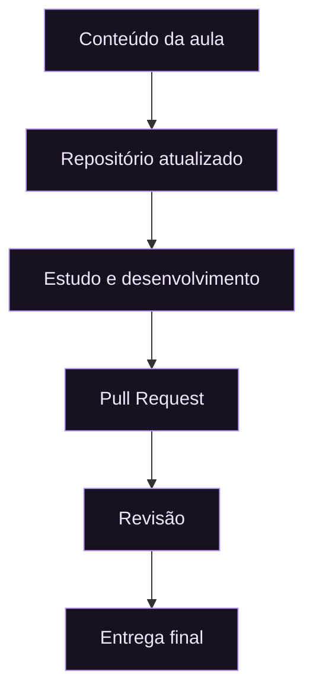

<br />

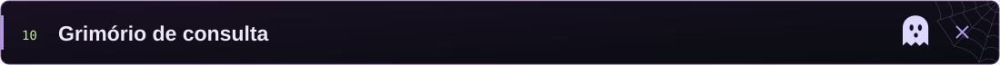

- [Portal do Aluno FIAP](https://on.fiap.com.br/)
- [Documentação do GitHub](https://docs.github.com/pt)
- [Conventional Commits](https://www.conventionalcommits.org/pt-br/v1.0.0/)
- [MDN Web Docs](https://developer.mozilla.org/pt-BR/)
- [Documentação do React](https://react.dev/)
- [Documentação do TypeScript](https://www.typescriptlang.org/docs/)

<br />

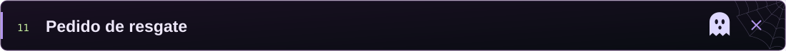

Mande mensagem para algum dos Tech Leads. Ao pedir ajuda, informe:

- o que você estava tentando fazer;
- o resultado esperado;
- o que aconteceu de fato;
- mensagem de erro completa;
- print ou trecho de código relevante.


